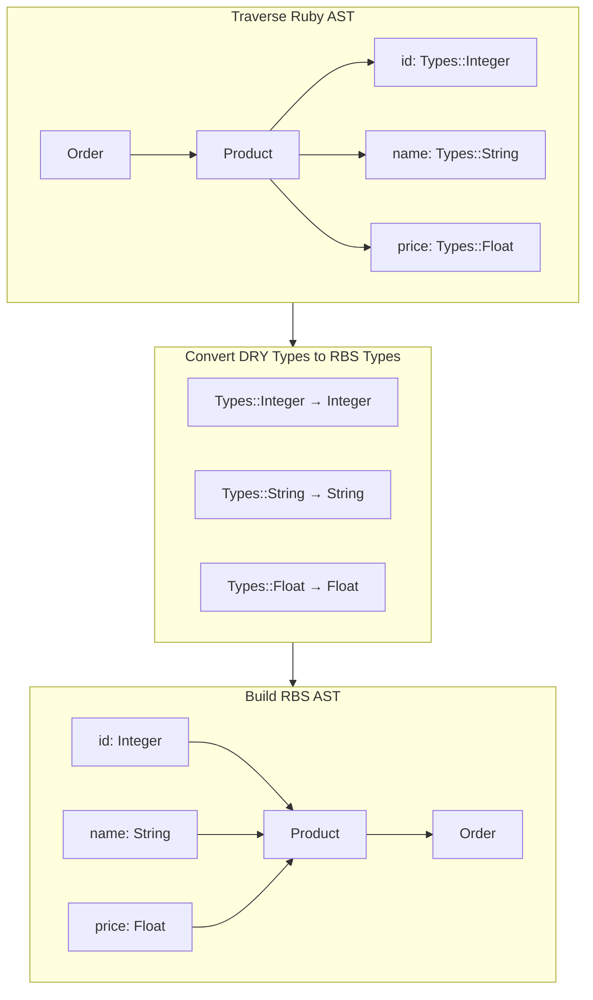

# DryStructRbs

A Ruby gem that automatically generates RBS type definitions for your [dry-struct](https://dry-rb.org/gems/dry-struct/) classes.

## Installation

Add to your Gemfile in the development group:

```ruby
group :development do
  gem 'dry_struct_rbs',
      git: 'https://github.com/seek-oss/dry_struct_rbs',
      branch: 'master'
end
```

Then execute:

```shell
bundle install
```

## Usage

Generate RBS files for your application with a single command:

```shell
bundle exec dry_struct_rbs app
```

### Options

| Option | Description |
|--------|-------------|
| `-w` | Write generated files to disk (without this flag, output is only displayed) |
| `-f` | Force overwrite existing RBS files |
| `-n NAMESPACE` | Set your dry-types namespace (default: `Types`) |
| `-i PATH` | Ignore directory prefix when generating output paths |

### Examples

Basic usage with file writing:
```shell
bundle exec dry_struct_rbs app -w
```

Generate files with a custom namespace and force overwrite:
```shell
bundle exec dry_struct_rbs app -w -f -n MyApp::Types
```

Generate files while stripping a directory prefix from output paths:
```shell
bundle exec dry_struct_rbs app/models/user.rb -w -i app/models
```

This will transform input paths like `app/models/user.rb` to `sig/user.rbs` instead of `sig/app/models/user.rbs`.

## Transformation Example

This gem automatically transforms your dry-struct Ruby classes into proper RBS type definitions. Here's an example:

**Original Ruby class:**

```ruby
module Order
  class Product < Dry::Struct
    attribute :id, Types::Integer
    attribute :name, Types::String
    attribute :price, Types::Float
    attribute :tags, Types::Array.of(Types::String)
    attribute :metadata, Types::Hash.of(Types::String, Types::Any)
    attribute :available, Types::Bool
    attribute :description, Types::String.optional
    attribute? :vendor_code, Types::Integer
  end
end
```

**Generated RBS type definition:**

```ruby
module Order
  class Product < Dry::Struct
    attr_reader id: Integer
    
    attr_reader name: String
    
    attr_reader price: Float
    
    attr_reader tags: Array[String]
    
    attr_reader metadata: Hash[String, untyped]
    
    attr_reader available: bool
    
    attr_reader description: String?
    
    attr_reader vendor_code: Integer?
  end
end
```

The gem handles various complex dry-types constructs and automatically maps them to their appropriate RBS equivalents.

<details> <summary>Mermaid Diagram (click to expand)</summary>


</details>

## Contributing

We welcome contributions from the community! Please check our [contribution guidelines](CONTRIBUTING.md) for more details on how to get involved.

## License

The gem is available as open source under the terms of the [MIT License](LICENSE).
